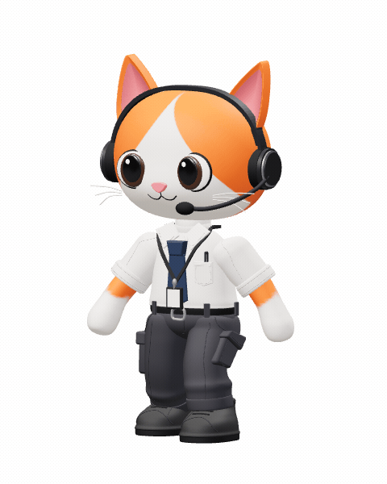
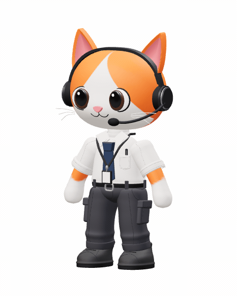

# 3D-Avatars

## Rigged Cat Operator

**[Download the rigged GLB](assets/cat-operator/cat-operator-rigged.glb)** — 12.1 MB, textures and animations embedded.

 

- **22 bones:** global root, hips, spine, chest, neck, head, shoulders, upper arms, forearms, hands, thighs, shins, feet, and toes.
- **Skinned geometry:** all 121 original meshes, up to four normalized bone influences per vertex.
- **Animations:** `Idle` (3.2 s), `Walk` (1.2 s), and `Wave` (2.4 s), all looping.
- **Walk is in-place.** Move the character through your scene separately, at approximately 0.70 asset units/second for the included walk cycle.
- **Global control:** `Root` is not keyed by the included clips, so it remains available for positioning and heading.
- **Checks:** zero Khronos errors/warnings; 33 sampled poses checked for deformation, foot contact, loop continuity, and export/re-import agreement. Bind-pose renders preserve the static model's appearance.

This is a stylized body rig. The mitten hands do not have finger bones, and there is no facial rig or cloth simulation. Engine-specific humanoid retargeting may require bone mapping. The original static GLB is preserved unchanged.

The viewer opens the rigged version by default. Use the animation selector, **Play/Pause**, and **Show skeleton**. Reduced-motion preferences disable autoplay. Choose **Static version** for the original assembly inspector.

With the local server running (FFmpeg is required only for GIF previews):

```sh
npm run export:rig
npm run capture:rig
npm test
npm run test:motion
npm run preview:rig
```

Rig authoring: [src/cat-rig.js](src/cat-rig.js). Joint names, rest positions, and clip metadata: [rig-contract.json](assets/cat-operator/rig-contract.json). Reports: [rig validation](assets/cat-operator/rig-validation.json) and [motion validation](assets/cat-operator/rig-motion-validation.json).

## Static Cat Operator

A detailed, procedural reconstruction of the supplied orange-and-white cat reference, wearing an office uniform and boom headset.

**[Download the GLB](assets/cat-operator/cat-operator.glb)**


- **Format:** glTF 2.0 binary, all textures embedded
- **Size:** 7.39 MB
- **Geometry:** 227,364 triangles; 121 named meshes
- **Materials:** 22 PBR materials; 8 embedded images
- **Pose:** static standing pose, no skeletal rig or animations
- **Orientation:** Y-up, facing +Z; approximately 3.49 units tall
- **Validation:** Khronos glTF Validator reports zero errors and zero warnings

Includes curved ears, glossy eyes, facial markings, whiskers, headset and microphone, rolled cuffs, tie, lanyard and ID badge, cargo pockets, garment seams, and detailed boots. This is a stylized approximation, not an exact scan or a watertight 3D-printing mesh. Fine cloth folds and facial geometry differ from the reference.

### Preview and rebuild

```sh
npm ci
npm run dev
```

Open the local URL printed by the server. Drag to orbit and scroll to zoom. Choose **Static version**, then **Inspect parts**, to separate the original model's main assemblies.

With the server running and Google Chrome installed:

```sh
npm run export
npm test
node scripts/capture.mjs --glb
node scripts/inspect.mjs
```

The editable model factory is [src/cat-operator.js](src/cat-operator.js). Front, rear, side, three-quarter, and close-up images are in [previews/cat-operator/glb](previews/cat-operator/glb). Asset checks are saved alongside the GLB.
