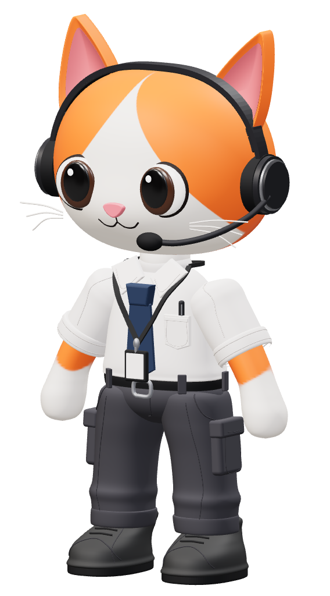

# 3D-Avatars

## Cat Operator

A detailed, procedural reconstruction of the supplied orange-and-white cat reference, wearing an office uniform and boom headset.

**[Download the GLB](assets/cat-operator/cat-operator.glb)**



- **Format:** glTF 2.0 binary, all textures embedded
- **Size:** 7.39 MB
- **Geometry:** 227,364 triangles; 121 named meshes
- **Materials:** 22 PBR materials; 8 embedded images
- **Pose:** static standing pose, no skeletal rig or animations
- **Orientation:** Y-up, facing +Z; approximately 3.49 units tall
- **Validation:** Khronos glTF Validator reports zero errors and zero warnings

Includes curved ears, glossy eyes, facial markings, whiskers, headset and microphone, rolled cuffs, tie, lanyard and ID badge, cargo pockets, garment seams, and detailed boots. This is a stylized approximation, not an exact scan or a watertight 3D-printing mesh. Fine cloth folds and facial geometry differ from the reference.

### Preview and rebuild

```sh
npm ci
npm run dev
```

Open the local URL printed by the server. Drag to orbit, scroll to zoom, or use **Inspect parts** to separate the main assemblies.

With the server running and Google Chrome installed:

```sh
npm run export
npm test
node scripts/capture.mjs --glb
node scripts/inspect.mjs
```

The editable model factory is [src/cat-operator.js](src/cat-operator.js). Front, rear, side, three-quarter, and close-up images are in [previews/cat-operator/glb](previews/cat-operator/glb). Asset checks are saved alongside the GLB.
